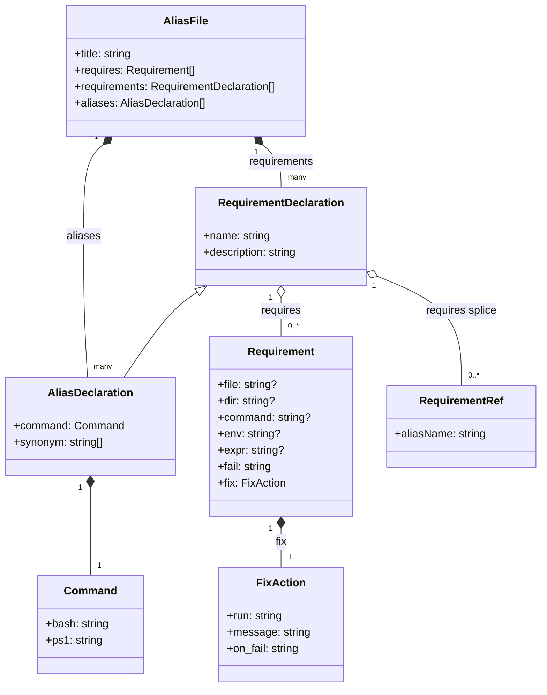

# yaffa-sah

A personal [YAFFA](https://github.com/stenaksel/YAFFA) user folder (`~/.yaffa`), for Sten Aksel Heien.
Public for [YAFFA](https://github.com/stenaksel/YAFFA)-users to copy and use for their own YAFFA user folder.


## Generated files

Everything under [`gen/`](gen/) is **generated by [YAFFA](https://github.com/stenaksel/YAFFA)** — do not edit those files directly.
To change them, edit the alias definitions in the user [`config/`](config/) folder and re-run the [YAFFA](https://github.com/stenaksel/YAFFA) generator.

| Folder | Contents |
|---|---|
| [`gen/bash-stuff/`](gen/bash-stuff/) | Bash aliases and functions — see its [README](gen/bash-stuff/README.md) for setup |
| [`gen/ps1-stuff/`](gen/ps1-stuff/) | PowerShell aliases and functions — see its [README](gen/ps1-stuff/README.md) for setup |

## My own aliases

[`config/alias_my.yaml`](config/alias_my.yaml) holds my own aliases. An alias here with the same
name as a YAFFA project alias replaces it. YAFFA generates `alias_my.sh` / `alias_my.ps1` from it.

## The `alias_*.yaml` file structure

The description below is adapted from the [YAFFA README](https://github.com/stenaksel/YAFFA#readme).

### Multiple config files

Aliases can be split across multiple `alias_*.yaml` files in the `config/` directory. All matching files are merged alphabetically when
generating:

```
config/
  alias_default.yaml   # general aliases
  alias_docker.yaml    # docker-specific aliases
  alias_git.yaml       # git-specific aliases
```

### Alias declaration model

The shape every `alias_*.yaml` entry follows:



- An `aliases:` entry is a `requirements:` entry plus `command` and `synonym`. A `requirements:` entry is a named group of
  checks, not a real alias — though it is still generated as a directly callable alias/function (see "Guard alias" below).
- `requires` is always a list. It mixes `Requirement` entries (real preconditions, always a map) with bare strings naming
  another declaration (`- <name>`). A bare name splices that declaration's own `requires` in at this position — followed
  transitively, with cycle detection. A splice can only reference a `requirements:` entry, never a regular alias.
- `fix` (`fix.run` / `fix.message` / `fix.on_fail`) gives a requirement automatic remediation when its check fails.
- A file-level `requires:` (sibling to `title:` / `requirements:` / `aliases:`) is prepended to the `requires:` of every
  `aliases:` entry in that file — a shared guard without repeating `requires: - <name>` on each alias.
  `requirements:` entries don't get it.

### Guard alias

A guard alias has no command, just precondition checks. It is declared under `requirements:`, not `aliases:`.
When many aliases share a precondition, put it in a `requirements:` entry once and splice it in by name.

Example: `req_pom_and_mvn`, a guard used by Maven-related aliases:

```yaml
requirements:
  # Guard: no command, just precondition checks.
  - name: req_pom_and_mvn
    description: Check that pom.xml exists and mvn is on PATH
    requires:
      - file: pom.xml
        fail: "No pom.xml — run from a Maven project root"
      - command: mvn
        fail: "mvn not on PATH — install Maven first"

aliases:
  - name: mcu-d
    synonym: mddu
    command: mvn versions:display-dependency-updates
    description: 'Maven Check Updates - Dependencies'
    requires:
      - req_pom_and_mvn
```

### Synonym aliases (`synonym`)

Use `synonym` to declare additional names for the same command. All synonyms share the same `command`, `description`
and `requires` checks. List one or more synonyms as a comma-separated string (or a YAML list):

```yaml
  - name: mcu-d
    synonym: mcud, mddu
    command: mvn versions:display-dependency-updates
    description: 'Maven Check Updates - Dependencies'
    requires:
      - req_pom_and_mvn
```

This generates `mcud` and `mddu` alongside the primary `mcu-d` alias.

### Conditional commands (`case` / `else`)

Instead of a single command string, `command` can hold a `case` list that picks the command to run based on what's in
the current directory. The entries are checked in order, and the first match wins:

- `file:` — the entry matches when that file exists in the current directory
- `use:` — the command to run when the entry matches
- `else:` — the error message shown when no entry matches (nothing is run)

Example from [`config/alias_my.yaml`](config/alias_my.yaml): one `tdd` alias that runs the unit tests for a Maven,
Gradle or pytest project:

```yaml
  - name: tdd
    command:
      case:
        - file: pom.xml
          use: mvn clean test
        - file: gradlew
          use: ./gradlew jvmTest
        - file: pytest.ini
          use: python -m pytest tests
        - file: requirements-dev.txt
          use: python -m pytest tests
      else: No Maven, Gradle or pytest project found here — run 'tdd' from a project root
    description: Run the unit (TDD) tests — Maven, Gradle or pytest project
```

This generates an `if` / `elif` / `else` chain in both the Bash and PowerShell versions of the alias. Extra arguments are
passed on to the chosen command, so `tdd -o` runs `mvn clean test -o` in a Maven project.

### OS differences to be aware of

- **Bash:** an alias is literal text substitution, so arguments can be hardcoded into it (e.g. `alias gs='git status'`).
- **PowerShell:** an alias can only point to the name of a cmdlet, function or executable — it cannot contain parameters
  or flags. An alias with predefined arguments needs a wrapper function, with the alias pointing to that function.
